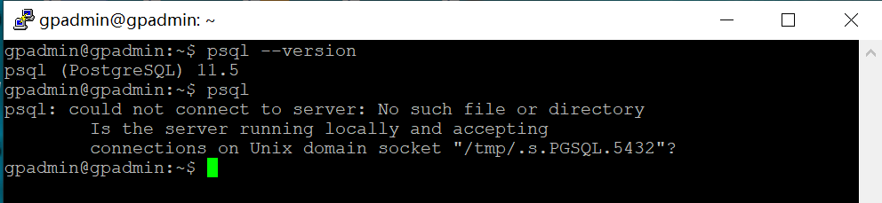
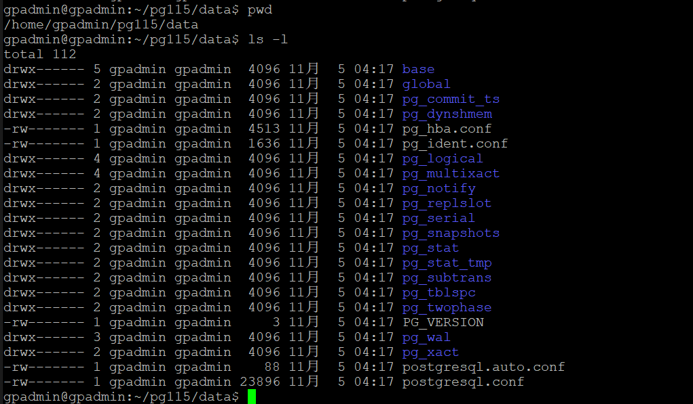
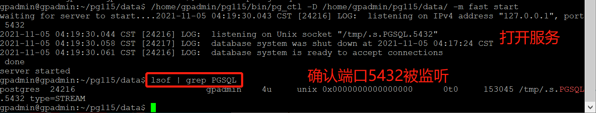
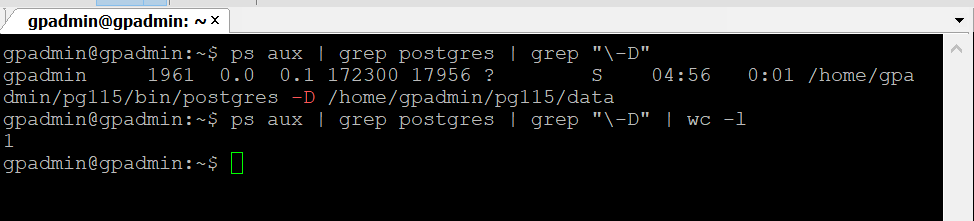

#### 源码安装
```
$ apt install -y zlib1g-dev libreadline-dev
$  ./configure  --enable-debug --enable-depend --enable-cassert --prefix=/home/gpadmin/pg115
$ make -j4 & make install
```

$ vim  /home/gpadmin/.bashrc
```
export PG_HOME=/home/gpadmin/pg115
export PATH=$PG_HOME/bin:$PATH
LD_LIBRARY_PATH=/home/gpadmin/pg115/lib
export LD_LIBRARY_PATH
```

```
$ source  /home/gpadmin/.bashrc
$ psql --version
```



```
$ /home/gpadmin/pg115/bin/initdb -D /home/gpadmin/pg115/data/
$ /home/gpadmin/pg115/bin/pg_ctl -D /home/gpadmin/pg115/data/ -m fast start
```




以下用一个简单的办法进入数据库：
```
$ psql template1
$ create user gpadmin with password '123456';
$ create database gpadmin owner gpadmin;
$ grant all privileges on database gpadmin to gpadmin;
$ \q
# 此后随时都可以进入
$ psql
```


#### 如何gdb调试