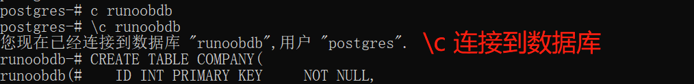
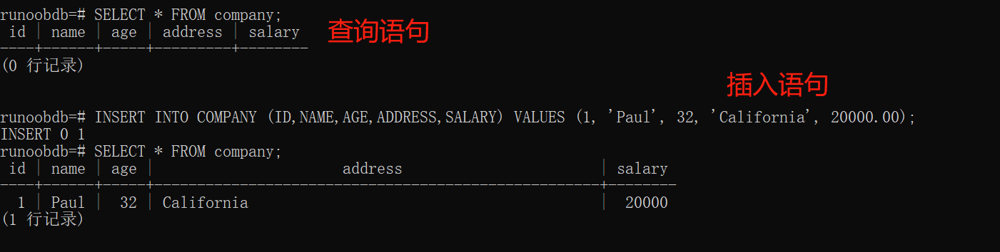
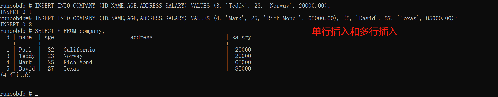

#### (1) 创建数据库


#### (2) 连接数据库


#### (3) 创建数据表


#### (4) 查看表格


#### (5) 插入语句


#### (6) 多行插入


#### (7) 运算符


#### (8) 解释查询


#### (9) 创建索引


#### (10) 测试索引

- 索引不应该使用在较小的表上。
- 索引不应该使用在有频繁的大批量的更新或插入操作的表上。
- 索引不应该使用在含有大量的 NULL 值的列上。
- 索引不应该使用在频繁操作的列上。

#### (11) 快速插入大量数据


#### (12) 测试索引-V2
```
$ create table tbl_test (id int, info text, c_time timestamp);
$ insert into tbl_test select generate_series(1,100000),md5(random()::text),clock_timestamp();
# select count(id) from tbl_test; 
$ create index id_index on tbl_test (id);
$ explain analyse select * from tbl_test where id = 56000;
```
