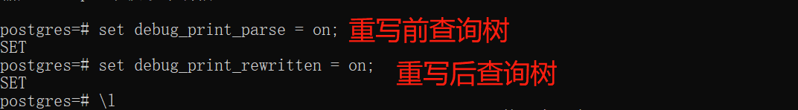
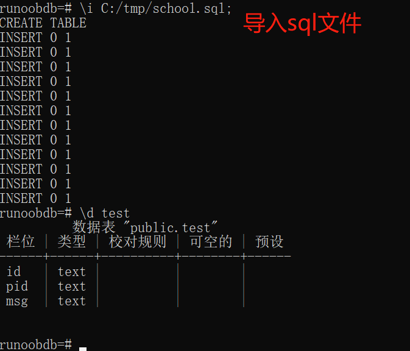
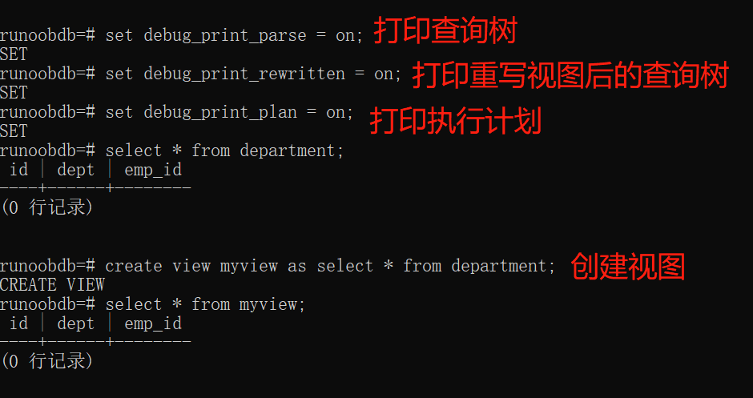
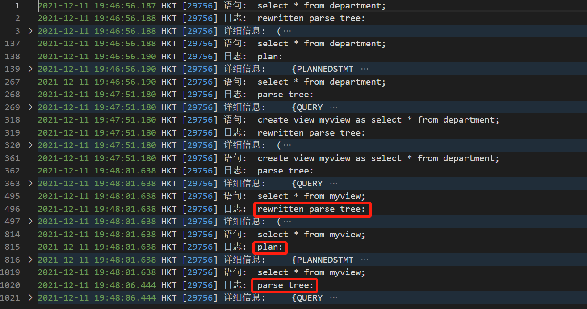

我想改源码，用elog_node_display函数打印查询树，来看子查询提升和提升后的查询树内容变化。

C:/Program Files/PostgreSQL/13/data/

#### Show config_file;

#### log配置

P31页 查询树展示，我想改源码，用elog_node_display函数打印查询树，来看子查询提升和提升后的查询树内容变化。

#### 导入sql文件

#### 创建视图

#### 日志情况

