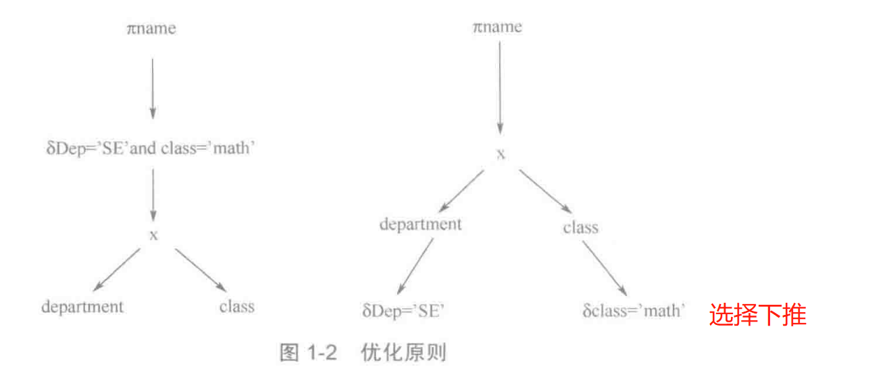

#### optimizer之前的准备

马上就进入pg_plan_queries->pg_plan_query->planner

#### optimizer目录

#### subquery_planner查询优化步骤

流程：
1、查询语句->原始语法树
2、原始语法树->查询语法树(Query)
3、查询语法树预定义转换
4、planner逻辑优化
5、planner物理优化
6、创建查询计划

查询语句经过词法分析和语法分析，由parse目录中的scan.I(Lex)和gram.y(Yacc)对其中的规则进行描述，最后生成查询树。

#### 经典策略-->选择下推

经典优化策略：选择下推，先选择后投影，从而尽可能减少中间结果的产生。

查询优化的一个基本原则是：先执行选择操作，后执行投影操作。影响选择操作优劣的额一个重要因素是对选择操作的约束条件的处理，将约束条件尽可能的“下推”至基表中，从而可大大减少产生的中间结果。

#### 第4-6章

第4章 查询逻辑优化
第5章 查询物理优化
第6章 查询计划的生成
create_plan 
create_plan_recurse 实际入口