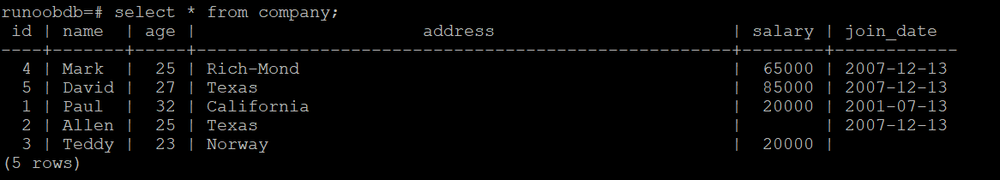
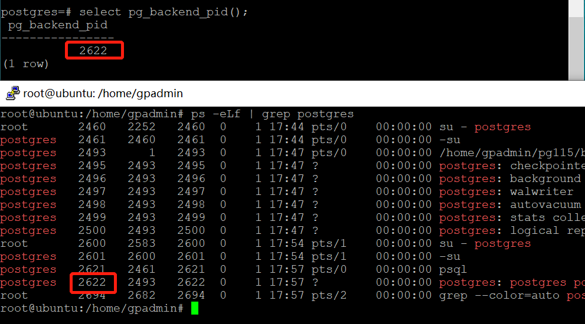
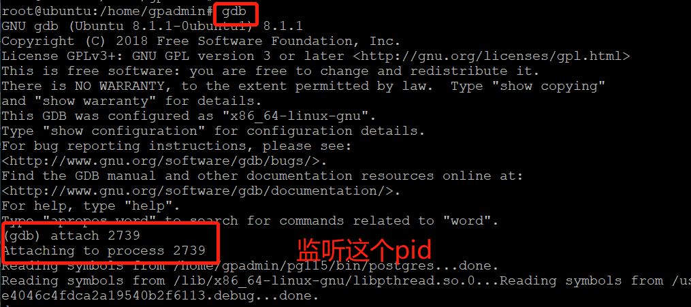
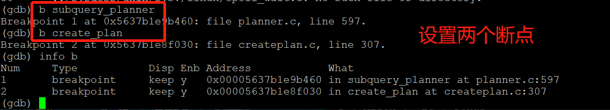
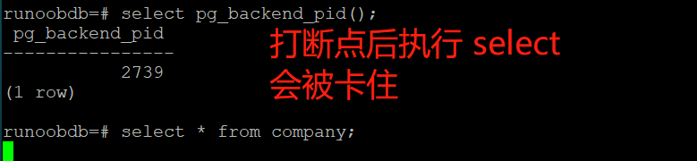
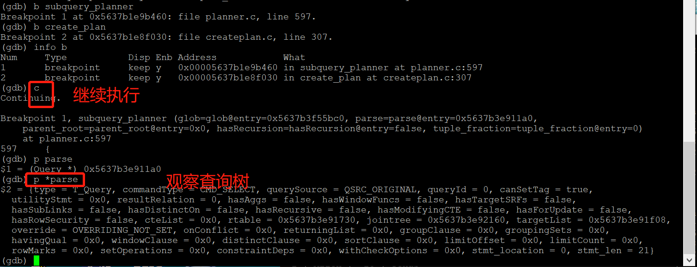
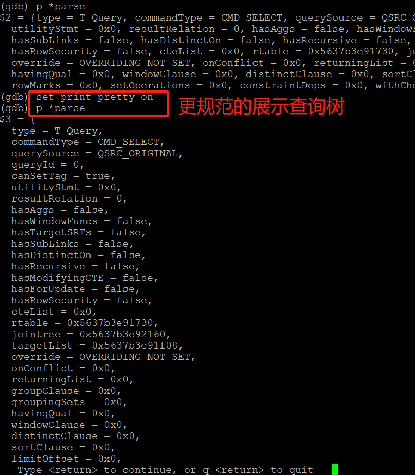
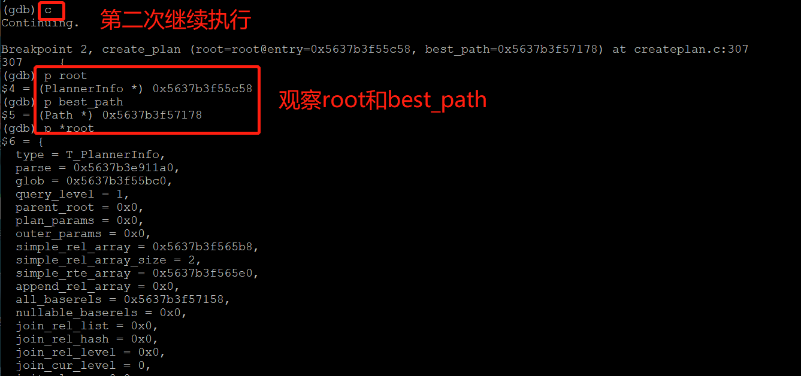
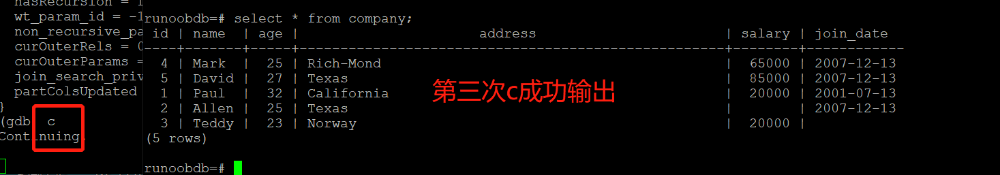

### 测试前准备
##### 1、我们想观察subquery_planner和create_plan两个函数。
- subquery_planner
- create_plan
先生成一张表，在菜鸟教程上抄几个命令过来。

打开几个日志开关为了以后查日志用。日志位置在？？？？？？？？？？？？？？？？？？？？
```
# set debug_pretty_print = on;
# set debug_print_parse = on;
# set debug_print_rewritten = on;
# set debug_print_plan = on;
```
##### 2、确定和监听pid


```
$ gdb 
$ attach XXX
```


### 正式开始
##### 0、常用gdb命令
- b 设置断点
- c 继续执行
- info b 显示断点信息
- p 观察变量

##### 1、打断点

```
$ b subquery_planner
$ b create_plan
$ info b
```

打了断点后在终端执行select，会处于等待状态没有输出

##### 2、观察subquery_planner

```
$ set print pretty on
```
让数据更好的输出展示：

##### 3、观察create_plan



##### 4、成功输出

累计3次c后，select才成功执行。