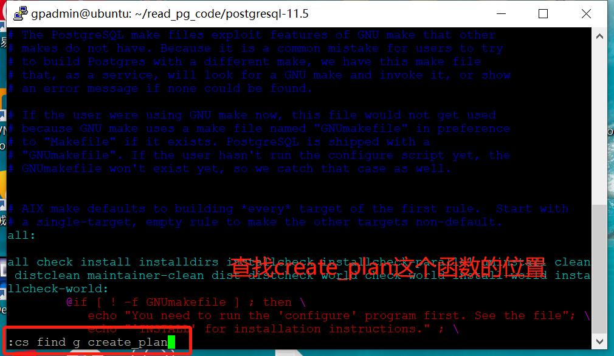

前提准备
- 先把代码存到一个目录下，源代码就行不用make。
- apt-get install cscope


生成索引数据
```
$ find /home/gpadmin/read_pg_code/postgresql-11.5 -name "*.c" -o -name "*.o" >./cscope.files
$ cscope -Rbq
```


教程里说打开Makefile，事实上不需要，随便用vim打开一个文件就可以。
```
$ vim test.sh
$ cs add ./cscope.out
$ cd show
$ cd find g create_plan
```





cs find
- 0或s：查找这个(指name参数，下同)C符号。
- 1或g：查找这个定义。
- 2或d：查找被这个函数调用的函数。
- 3或c：查找调用该函数的函数。
- 4或t：查找这个文本字符串。
- 6或e: 查找这个egrep的pattern。
- 7或f：查找这个文件。
- 8或i：查找#include了这个文件的所有文件。