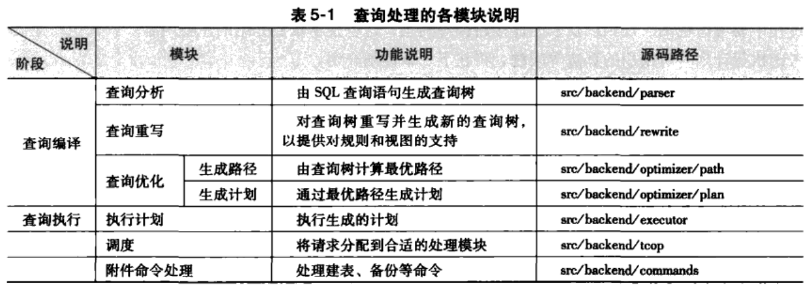
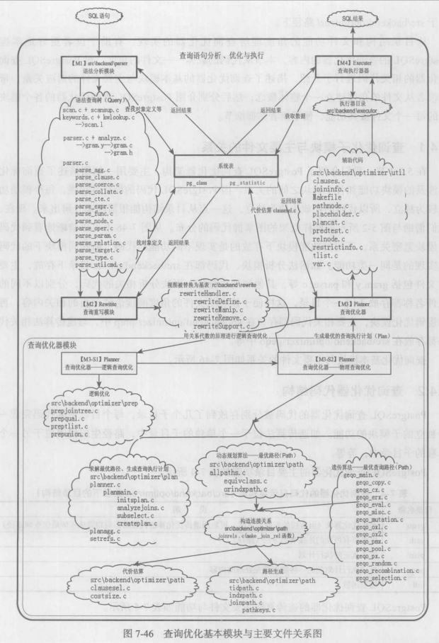
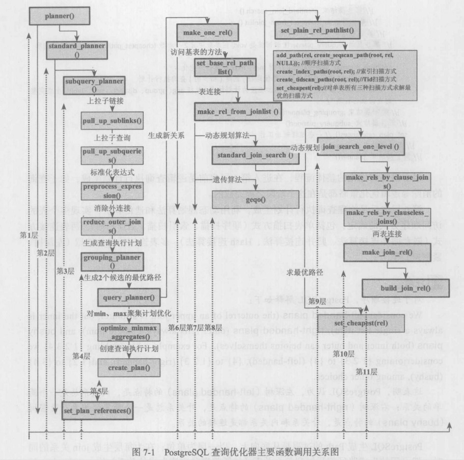

### 一、所有参考资料
书籍
《postgreSQL数据库内核分析》简写《内核》
《数据库查询优化器的艺术：原理解析与SQL性能优化》简写《艺术》
《PostgreSQL查询引擎源码技术探析》简写《引擎》
《PostgreSQL技术内幕：查询优化深度探索》简写《内幕》
源码用10.0版

### 二、代码结构
下图来自《内核》P-188页

下图来自《艺术》P-188页

### 三、代码流程

- SQL --> Parser --> 
- 查询树（抽象语法树） --> Optimizer --> 
- 执行计划 --> Executor --> 
- SQL结果

两棵树
- 分析树 SQL完成词法和语法分析，生成分析树；在经过语义分析，生成-->
- 查询树（抽象语法树）

下图来自《艺术》P-114页

很长的调用链条
- exec_simple_query (./tcop/postgres.c) 入口
    - pg_parse_query (./tcop/postgres.c)
        - raw_parser (./parser/parser.c) 完成词法和语法分析，生成分析树
    - pg_analyze_and_rewrite (./tcop/postgres.c)
        - parse_analyze (./parser/analyze.c) 完成语义分析，生成查询树
        - pg_rewrite_query (./tcop/postgres.c) 重写查询树
    - pg_plan_queries (./tcop/postgres.c)
        - pg_plan_query (./tcop/postgres.c)
            - planner (./optimizer/plan/planner.c) 主入口函数
                - standard_planner  (./optimizer/plan/planner.c) 标准查询优化器函数
                    - subquery_planner (./optimizer/plan/planner.c) 生成子查询执行计划函数
                        * pull_up_sublinks 提升子连接
                        * pull_up_subqueries 提升子查询
                        * preprocess_expression 预处理表达式
                        * preprocess_qual_conditions 预处理约束条件
                        * inheritance_planner
                        * grouping_planner 进入主规划阶段
                        * SS_finalize_plan 清理计划树
                    - create_plan (./optimizer/plan/createplan.c)

一个总入口
- planner ./optimizer/planner

两个关键流程
- 逻辑优化 ./optimizer/prep
    - 逻辑重写优化（原为改造
        - 子查询/子连接提升
        - 外连接消除
        - 谓词规范
        - 结果：没有右外连接
    - 逻辑分解优化（打散重建）
        - 谓词下推
        - 交换连接顺序
        - 难点：解决LeftJoin，SemiJoin，AntiJoin
- 物理优化 ./optimizer/path

### 四、经典策略谓词下推的实现

- grouping_planner (./optimizer/plan/planner.c) 
    - query_planner (./optimizer/plan/planmain.c)
        - deconstruct_jointree (./optimizer/plan/inisplan.c)
        
- grouping_planner (./optimizer/plan/planner.c) 
    - preprocess_minmax_aggregates (./optimizer/plan/planagg.c)
        - build_minmax_path (./optimizer/plan/planagg.c)
            - query_planner (./optimizer/plan/planmain.c)
                - deconstruct_jointree (./optimizer/plan/inisplan.c)

综上，谓词下推的代码都在grouping_planner往后。

### 五、第一个操作 pull_up_sublinks() 和 pull_up_subqueries()

《艺术》P-118页

### 六、重要问题
《内核》P-281页 习题5.1 GDB调试 SELECT * FROM shoelace;