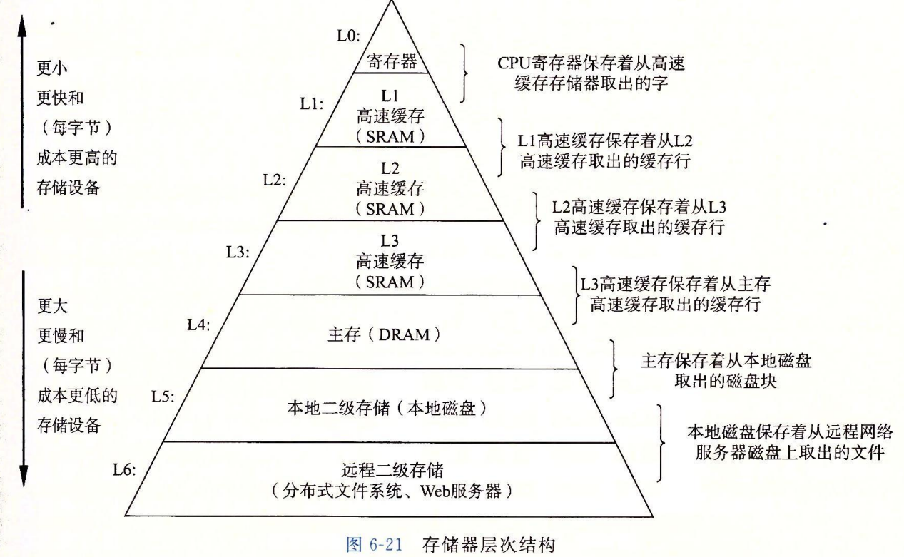

### 6.1 存储技术
- RAM：SRAM快且贵（高速缓存）；DRAM慢但便宜（内存）
- ROM
- 磁盘

### 6.2 局部性
- 时间局部性
- 空间局部性

循环体越小，迭代越多，则局部性越强。

### 6.3 存储器层次结构

### 6.4 高速缓存存储器
- 直接映射
- 组相联映射
- 全相联映射

### 6.5 编写高速缓存又有的代码

核心：提高缓存命中率

### 6.6 高速缓存对程序性能的影响

