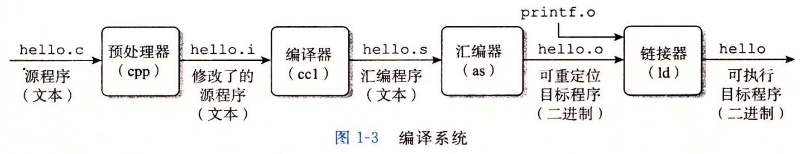
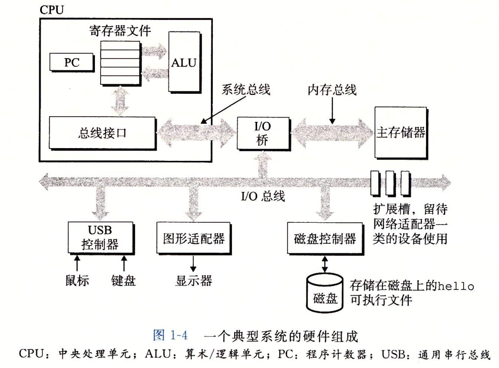
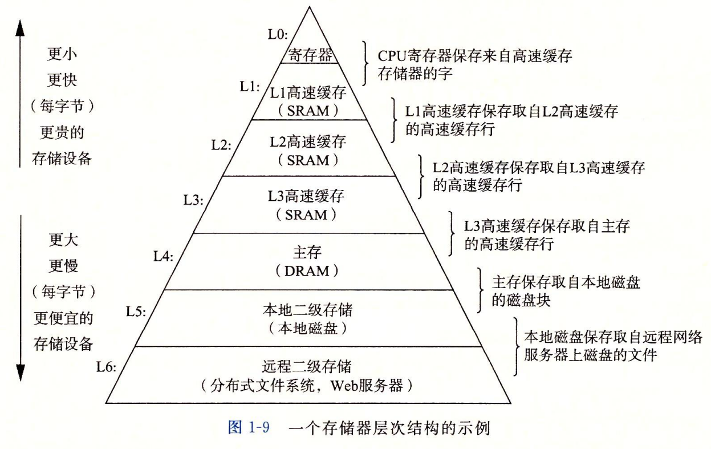
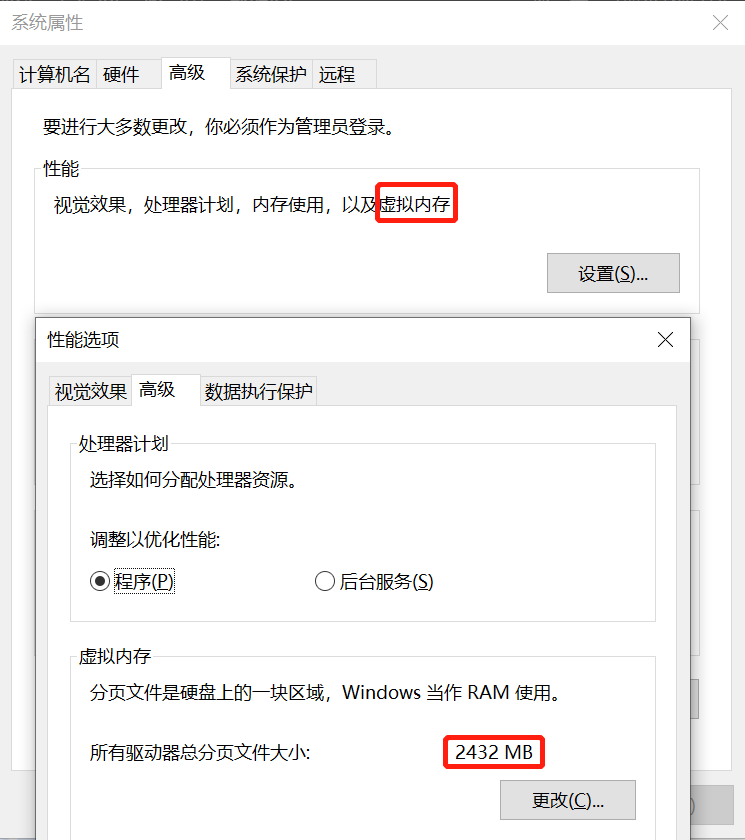

### 一、重要架构图

#### 1.1 编译系统

#### 1.2 硬件组成

#### 1.3 存储器层次结构

### 二、几个基础概念

#### 2.1 物理内存和虚拟内存：

**物理内存**：就是指计算机的安装的主存，通俗的讲就是我的电脑内存16GB，这个内存。

**虚拟内存**：在很久以前，还没有虚拟内存概念的时候，程序寻址用的都是物理地址。32位的计算机可寻址的范围是2^32也就是4G。现在，每个进程运行时都会得到4G的虚拟内存。但是实际上，在虚拟内存对应的物理内存上，可能只对应的一点点的物理内存，实际用了多少内存，就会对应多少物理内存。这里还存在主存和硬盘交互（借用）的情况，自然就会慢。

#### 2.2 进程和线程：

**进程**：进程是CPU资源分配最小单位。进程切换指的切换指令序列和资源。

**线程**：线程切换只切换指令序列，不切换资源。

#### 2.3 并发和并行：

**并发**：线程级并发

**并行**：指令级并行和单指令多数据并行（SIMD）
