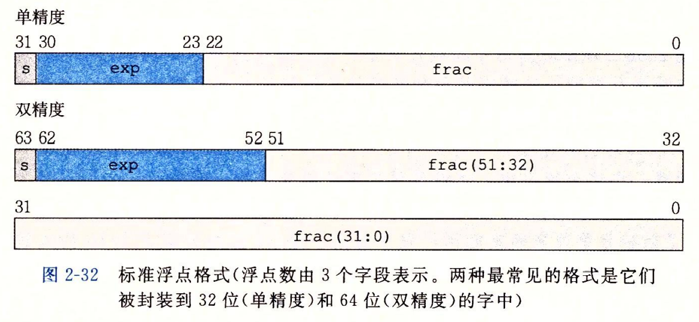

### 2.1 信息存储

|  机器字长   | 虚拟地址  |
|  ----  | ----  |
| 32  | 2^32 = 4GB |
| 64  | 2^64 = 16EB |

数值在 0x01234567 内存中：
|     | 大端法  | 小端法 |
|  ----  | ----  | ----  |
| 高位  | 01 | 67 |
|  | 23 | 45 |
|  | 45 | 23 |
| 低位 | 67 | 01 |
注：Intel x86架构使用小端法。

### 2.2 整数的表示 & 2.3 整数的运算

读取时区分，存储是不区分。

解释：计算机硬件不需要区别存储在此处的32比特是int是float还是unsigned int。读取时区分，区分是编译器的工作。

|     | 原码  | 反码  | 补码  |
|  ----  | ----  | ----  | ----  |
|  正数  | 原码  | = 原码 | = 原码  |
|  负数  | 原码  | 符号位不变，其它各位取反  | = 反码+1  |

计算机中，正数用原码（也就是补码）；负数用补码。综上，计算机中正数就是用补码运算。

假设一个4bit机器

|     | 原码  | 反码  | 补码  |
|  ----  | ----  | ----  | ----  |
|  +1  | 0001  | 0001 | 0001  |
|  -3  | 1011  | 1100  | 1101  |
|  -2  | 1010  | 1101  | 1110  |

示例，()中都是补码：1 - 3 = (+1) + (-3) = (0001) + (1101) = (1110) = -2

### 2.4 浮点数

32位float s=1 k=8 n=23

64位double s=1 k=11 n=52

