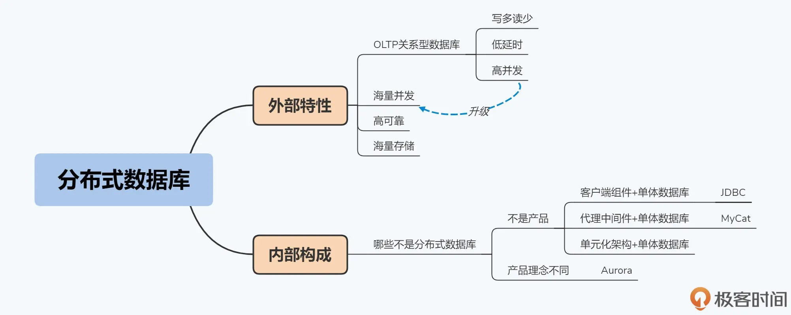

分布式数据库定义：
分布式数据库是服务于写多读少、低延时、海量并发 OLTP 场景的，具备海量数据存储能力和高可靠性的关系型数据库。

| | OLTP 联机交易 | OLTP 联机分析|
|---| --- | --- |
| 数据量 | 小 | 大 |
| 速度 | 快 | 相对慢 |
| 常见应用 | 转账 | 生成年度账单 |
| 产品 | Oracle | Greenplum |

