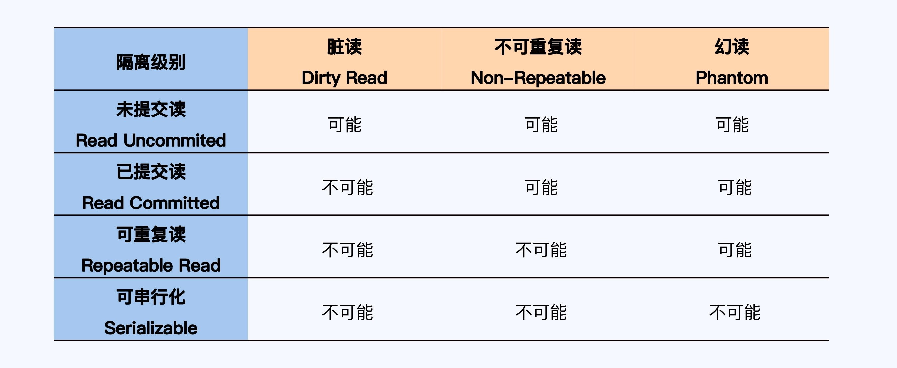
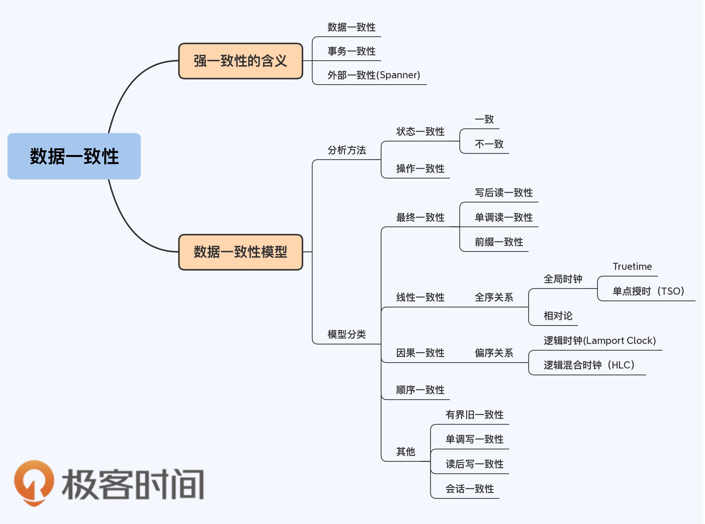
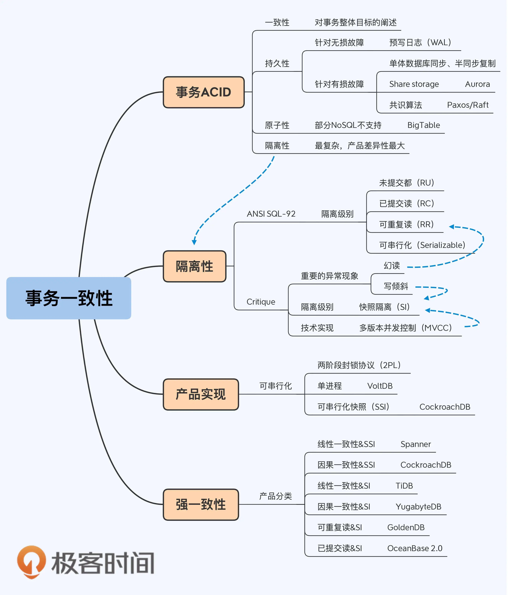

强一致性
第二节主要讲数据强一致性；第三节主要讲事务强一致性。

### 几个重要原理
CAP原理
- C consistency 一致性
- A availability 高可用性
- P partition tolerance 分区容忍性

ACID：DBMS为了保证事务正确可靠，需遵循ACID
- A Atomicity 原子性：事务要么全发生，要么全不发生。
- C Consistency 一致性：事务要保持数据完整性。
- I Isolation 隔离性：并行执行结果==串行执行结果。
- D Durability 持久性：事务提交则永久保留。

BASE
- Ba Basically 基本可用性 -> 功能解耦
- S  Soft state 软状态
- E  Eventual Consistency 最终一致性 

